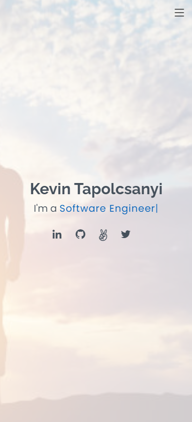

<td width="50%" valign="top"> <!--Start of Portfolio Website to use 50% of the window-->
      <h1 align="center">My Portfolio Website</h1>
        <!--Click Profile Image to open a new window to Profile website-->
      <a target="_blank" href="https://kevintapolcsanyi.netlify.app/">
        <!--  -->
        
      </a>
       
      
 
      </a>  <!--Click website icon to open a new window to Profile website-->
      
      
 <!--Description of technologies and functionality of Portfolio website-->
      
<strong>HTML, CSS Javascript, JQuery, Bootstrap Icons and Classes and Font Awesome Icons </strong>
 
      
A github hosted Profile website with Web App gifs of functionality and mouse hover over descriptions and technologies used for each Web App.

    </td> <!--End of Portfolio-->